# 🧬 PharmaGuard  
### AI-Powered Pharmacogenomic Clinical Decision Support System


---

## 🚀 Overview

**PharmaGuard** is a CPIC-aligned pharmacogenomic interpretation engine that transforms raw VCF genomic data into actionable clinical drug recommendations.

It combines:

- 🧬 Star allele resolution
- 📊 Activity score modeling
- 🧠 Phenotype inference
- ⚖ CPIC-based risk classification
- 📈 Confidence scoring
- 💊 Drug-specific clinical recommendations
- 🖥 Interactive React dashboard

---

# 🧠 System Architecture

```mermaid
flowchart LR
    A[VCF File Upload] --> B[VCF Parser]
    B --> C[Variant Extraction]
    C --> D[Star Allele Resolution]
    D --> E[Activity Score Engine]
    E --> F[Phenotype Determination]
    F --> G[CPIC Risk Engine]
    G --> H[Clinical Recommendation]
    H --> I[Confidence Scoring]
    I --> J[Frontend Dashboard]
```



---

## 🏗 Project Structure

```
PharmaGuard/
│
├── backend/
│   ├── main.py
│   ├── rule_engine.py
│   ├── mappings.py
│   ├── vcf_parser.py
│   ├── llm_service.py
│   ├── requirements.txt
│
├── frontend/
│   ├── src/
│   ├── components/
│   ├── services/
│   ├── types/
│   ├── package.json
│
├── README.md
└── .gitignore
```

---

## 🧬 Supported Genes

| Gene      | Enzyme / Protein | Primary Role | Clinical Relevance | Example Drugs |
|-----------|-----------------|--------------|--------------------|---------------|
| **CYP2D6** | Cytochrome P450 2D6 | Phase I drug metabolism | Alters opioid activation and antidepressant metabolism | Codeine, Tramadol |
| **CYP2C19** | Cytochrome P450 2C19 | Prodrug activation & PPI metabolism | Affects antiplatelet efficacy | Clopidogrel, Omeprazole |
| **CYP2C9** | Cytochrome P450 2C9 | Anticoagulant metabolism | Influences bleeding risk | Warfarin, Phenytoin |
| **SLCO1B1** | OATP1B1 Transporter | Hepatic drug uptake | Associated with statin-induced myopathy | Simvastatin |
| **TPMT** | Thiopurine S-methyltransferase | Thiopurine metabolism | Risk of myelosuppression | Azathioprine, Mercaptopurine |
| **DPYD** | Dihydropyrimidine Dehydrogenase | Fluoropyrimidine metabolism | Risk of life-threatening toxicity | Fluorouracil |

---

## 💊 Supported Drugs

Codeine

Tramadol

Clopidogrel

Omeprazole

Warfarin

Phenytoin

Simvastatin

Azathioprine

Mercaptopurine

Fluorouracil

---

## ⚙ Backend Engine Flow

```
sequenceDiagram
    participant User
    participant FastAPI
    participant Parser
    participant RuleEngine
    participant CPIC
    participant Response

    User->>FastAPI: Upload VCF + Drugs
    FastAPI->>Parser: Parse variants
    Parser->>RuleEngine: Extract gene variants
    RuleEngine->>RuleEngine: Determine diplotype
    RuleEngine->>RuleEngine: Calculate activity score
    RuleEngine->>RuleEngine: Infer phenotype
    RuleEngine->>CPIC: Assess risk
    CPIC->>Response: Recommendation + Severity
    Response->>User: JSON + Dashboard Data
```

---

## 🧪 Example Clinical Output

```
{
  "drug": "CLOPIDOGREL",
  "risk_assessment": {
    "risk_label": "Ineffective",
    "severity": "high",
    "confidence_score": 0.97
  },
  "pharmacogenomic_profile": {
    "primary_gene": "CYP2C19",
    "diplotype": "*2/*2",
    "phenotype": "PM",
    "activity_score": 0
  }
}
```

---

## 📊 Confidence Scoring Model

Confidence is calculated using:

Variant detection completeness

Zygosity validation

CPIC evidence level

Star allele resolution confidence

Multi-variant concordance

Mathematically modeled as weighted scoring between 0.5 – 0.99.

---

## 🖥 Frontend Dashboard

Features:

Multi-drug tab view

Risk severity visualization

Animated confidence scoring

Variant-level breakdown

Clinical recommendation panel

JSON export

Copy to clipboard

---

## 🚀 Setup Instructions
### 🔹 Backend

```
cd backend
python -m venv venv
venv\Scripts\activate
pip install -r requirements.txt
uvicorn main:app --reload
```
Runs at:

```
http://localhost:8000
```

### 🔹 Frontend

```
cd frontend
npm install
npm run dev
```
Runs at:

```
http://localhost:5173
```

---

## 🧠 Advanced Features

Multi-variant per gene handling

Activity scoring per allele (CPIC aligned)

CYP2D6 copy-number support

Phenotype normalization

Urgency classification

Alternative drug suggestions

Evidence-level tagging

---

## 🌍 Future Roadmap

VKORC1 integration for Warfarin

Polygenic risk modeling

Real CPIC database integration

Docker deployment

Cloud hosting (Render + Vercel)

PDF clinical report export

---

## 👩‍💻 Built With

FastAPI

React + TypeScript

CPIC Guidelines

Modern pharmacogenomic modeling

## 🔬 Impact

PharmaGuard illustrates how:

- Genetic variability influences drug response  
- Clinical guidelines can be computationally encoded  
- Decision-support systems can enhance medication safety  
- AI-assisted genomics can support precision therapeutics  

---

## 👩‍⚕️ Disclaimer

This system is intended for research, educational, and hackathon purposes only and is not designed for direct clinical use without validation.

---

**PharmaGuard — Advancing Precision Medicine Through Intelligent Genomic Interpretation.**
