# 🧬 PharmaGuard  
### AI-Powered Pharmacogenomic Clinical Decision Support System


---

## 🚀 Overview

**PharmaGuard** is a CPIC-aligned pharmacogenomic interpretation engine that transforms raw VCF genomic data into actionable clinical drug recommendations.

It combines:

- 🧬 Star allele resolution
- 📊 Activity score modeling
- 🧠 Phenotype inference
- ⚖ CPIC-based risk classification
- 📈 Confidence scoring
- 💊 Drug-specific clinical recommendations
- 🖥 Interactive React dashboard

---

# 🧠 System Architecture

```mermaid
flowchart LR
    A[VCF File Upload] --> B[VCF Parser]
    B --> C[Variant Extraction]
    C --> D[Star Allele Resolution]
    D --> E[Activity Score Engine]
    E --> F[Phenotype Determination]
    F --> G[CPIC Risk Engine]
    G --> H[Clinical Recommendation]
    H --> I[Confidence Scoring]
    I --> J[Frontend Dashboard]
```



---

## 🛠 Tech Stack

### 🔹 Frontend
- ⚛️ React (Vite + TypeScript)
- 🎨 CSS Modules / Custom Styling
- 🔄 Fetch API for backend integration
- 📊 Dynamic clinical dashboard components

### 🔹 Backend
- 🚀 FastAPI (Python)
- 🧬 Custom CPIC Rule Engine
- 🧮 Real Activity Score Calculator (Per Allele Model)
- 📁 VCF Parser (GRCh38 compatible)
- 🤖 Groq LLM API (for biological explanations)

### 🔹 AI Layer
- Groq LLM API
- Structured Prompt Engineering
- Mechanism-of-action generator

### 🔹 Deployment
- 🌐 Frontend: Vercel
- 🖥 Backend: Render
- 🔐 Environment Variables for API security

### 🔹 DevOps
- Git + GitHub
- CORS-secured API architecture

---

## 🏗 Project Structure

```
PharmaGuard/
│
├── backend/
│   ├── main.py
│   ├── rule_engine.py
│   ├── mappings.py
│   ├── vcf_parser.py
│   ├── llm_service.py
│   ├── requirements.txt
│
├── frontend/
│   ├── src/
│   ├── components/
│   ├── services/
│   ├── types/
│   ├── package.json
│
├── README.md
└── .gitignore
```

---

# 📡 API Documentation

## Base URL

https://your-backend.onrender.com

---

## 🔍 POST `/analyze`

Analyzes a VCF file against selected drugs.

### Request

**Content-Type:** `multipart/form-data`

| Field | Type | Description |
|-------|------|------------|
| file  | File (.vcf) | Genomic VCF file |
| drugs | String | Comma-separated drug names |

---

### Example Request (cURL)

```bash
curl -X POST "https://your-backend.onrender.com/analyze" \
  -H "Content-Type: multipart/form-data" \
  -F "file=@sample.vcf" \
  -F "drugs=CLOPIDOGREL,WARFARIN,CODEINE"
```

---

## 🧬 Supported Genes

| Gene      | Enzyme / Protein | Primary Role | Clinical Relevance | Example Drugs |
|-----------|-----------------|--------------|--------------------|---------------|
| **CYP2D6** | Cytochrome P450 2D6 | Phase I drug metabolism | Alters opioid activation and antidepressant metabolism | Codeine, Tramadol |
| **CYP2C19** | Cytochrome P450 2C19 | Prodrug activation & PPI metabolism | Affects antiplatelet efficacy | Clopidogrel, Omeprazole |
| **CYP2C9** | Cytochrome P450 2C9 | Anticoagulant metabolism | Influences bleeding risk | Warfarin, Phenytoin |
| **SLCO1B1** | OATP1B1 Transporter | Hepatic drug uptake | Associated with statin-induced myopathy | Simvastatin |
| **TPMT** | Thiopurine S-methyltransferase | Thiopurine metabolism | Risk of myelosuppression | Azathioprine, Mercaptopurine |
| **DPYD** | Dihydropyrimidine Dehydrogenase | Fluoropyrimidine metabolism | Risk of life-threatening toxicity | Fluorouracil |

---

## 💊 Supported Drugs

Codeine

Tramadol

Clopidogrel

Omeprazole

Warfarin

Phenytoin

Simvastatin

Azathioprine

Mercaptopurine

Fluorouracil

---

## ⚙ Backend Engine Flow

```
sequenceDiagram
    participant User
    participant FastAPI
    participant Parser
    participant RuleEngine
    participant CPIC
    participant Response

    User->>FastAPI: Upload VCF + Drugs
    FastAPI->>Parser: Parse variants
    Parser->>RuleEngine: Extract gene variants
    RuleEngine->>RuleEngine: Determine diplotype
    RuleEngine->>RuleEngine: Calculate activity score
    RuleEngine->>RuleEngine: Infer phenotype
    RuleEngine->>CPIC: Assess risk
    CPIC->>Response: Recommendation + Severity
    Response->>User: JSON + Dashboard Data
```

---

# 🧪 Usage Examples

```markdown
# 🧪 Usage Examples

## Example 1 — Clopidogrel

**Input:**
- CYP2C19 *2/*2

**Output:**
- Risk: Ineffective
- Severity: High
- Recommendation: Alternative antiplatelet therapy

---

## Example 2 — Warfarin

**Input:**
- CYP2C9 *1/*3

**Output:**
- Risk: Adjust Dosage
- Severity: Moderate
- Recommendation: Lower starting dose

---

## Example 3 — Codeine

**Input:**
- CYP2D6 *4/*4

**Output:**
- Risk: Toxic
- Severity: Critical
- Recommendation: Avoid codeine
```

---

## 📊 Confidence Scoring Model

Confidence is calculated using:

Variant detection completeness

Zygosity validation

CPIC evidence level

Star allele resolution confidence

Multi-variant concordance

Mathematically modeled as weighted scoring between 0.5 – 0.99.

---

## 🖥 Frontend Dashboard

Features:

Multi-drug tab view

Risk severity visualization

Animated confidence scoring

Variant-level breakdown

Clinical recommendation panel

JSON export

Copy to clipboard

---

## 🚀 Setup Instructions
### 🔹 Backend

```
cd backend
python -m venv venv
venv\Scripts\activate
pip install -r requirements.txt
uvicorn main:app --reload
```
Runs at:

```
http://localhost:8000
```

### 🔹 Frontend

```
cd frontend
npm install
npm run dev
```
Runs at:

```
http://localhost:5173
```

---

# 🌍 Applications

PharmaGuard enables real-world pharmacogenomic decision support across multiple healthcare and research domains.

---

## 🏥 1. Clinical Decision Support

- Assist physicians in prescribing genotype-guided therapies  
- Reduce adverse drug reactions (ADRs)  
- Optimize dosing strategies  
- Improve medication efficacy  
- Support CPIC-aligned prescribing practices  

---

## 💊 2. Precision Medicine Programs

- Integrate into hospital pharmacogenomics pipelines  
- Support preemptive genotyping initiatives  
- Enable personalized drug therapy selection  
- Provide explainable AI-backed recommendations  

---

## 🧬 3. Genomic Testing Laboratories

- Automate interpretation of PGx VCF panels  
- Standardize CPIC-based risk reporting  
- Generate structured clinical summaries  
- Reduce manual interpretation workload  

---

## 📊 4. Research & Academia

- Study genotype–phenotype correlations  
- Model drug response variability  
- Evaluate pharmacogenomic impact on clinical outcomes  
- Serve as a teaching tool for genomic medicine  

---

## 🏦 5. Digital Health & HealthTech Startups

- Integrate into EHR systems  
- Build patient-facing genomic dashboards  
- Develop AI-powered precision therapeutics platforms  
- Offer genomic risk analysis as a service  

---

## 🧪 6. Pharmaceutical & Clinical Trials

- Stratify patients based on metabolizer status  
- Improve drug safety profiling  
- Reduce trial variability  
- Support genotype-informed drug development  

---

## 🌐 7. Telemedicine & Remote Care

- Enable genotype-informed prescribing in virtual consultations  
- Provide decision support in resource-limited settings  
- Support genomic-based treatment personalization at scale  

---

## 🧠 8. AI in Healthcare Research

- Demonstrates rule-based + LLM hybrid architecture  
- Serves as a model for explainable AI in genomics  
- Bridges structured clinical guidelines with AI-generated insights  

---

# 🚀 Impact Potential

By transforming raw genomic data into actionable insights, PharmaGuard supports:

- Safer prescribing
- Reduced drug toxicity
- Improved therapeutic outcomes
- Scalable precision medicine infrastructure

## 🔬 Impact

PharmaGuard illustrates how:

- Genetic variability influences drug response  
- Clinical guidelines can be computationally encoded  
- Decision-support systems can enhance medication safety  
- AI-assisted genomics can support precision therapeutics  

---

# 👥 Team

## Anusha Saraswat  
**Role:** AI & Backend Architect  

- Designed and implemented the CPIC-based pharmacogenomic rule engine  
- Built real allele-level activity scoring model  
- Developed multi-variant gene interpretation logic  
- Integrated Groq LLM for biological mechanism explanations  
- Architected full FastAPI backend and API schema  
- Led deployment pipeline (Render + Vercel)

---

## Ratan Pandey 
**Role:** Frontend & Clinical Interface Engineer  

- Designed and built the React + TypeScript dashboard  
- Implemented dynamic genomic profile visualization  
- Integrated frontend with backend API  
- Developed risk visualization system (severity, confidence, color logic)  
- Implemented UX for clinical decision support  
- Handled deployment and production integration

---

## 👩‍⚕️ Disclaimer

This system is intended for research, educational, and hackathon purposes only and is not designed for direct clinical use without validation.

---

**PharmaGuard — Advancing Precision Medicine Through Intelligent Genomic Interpretation.**
